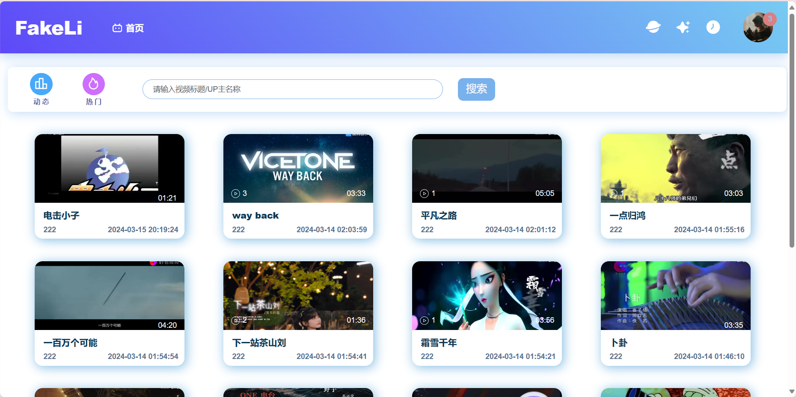
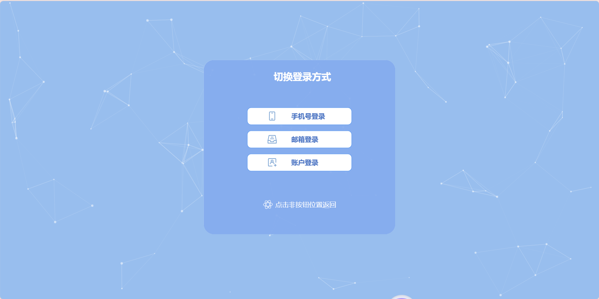
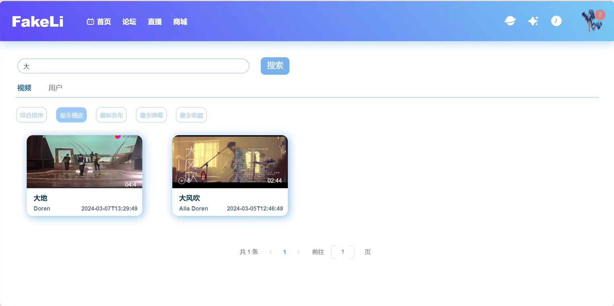
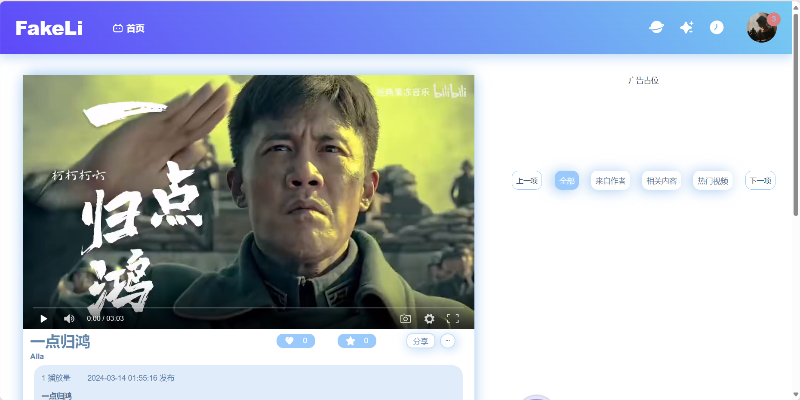
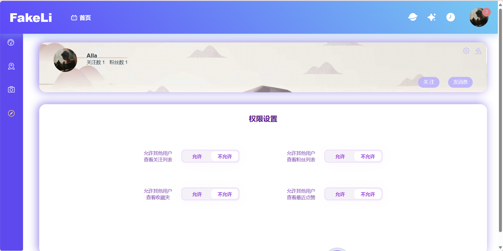
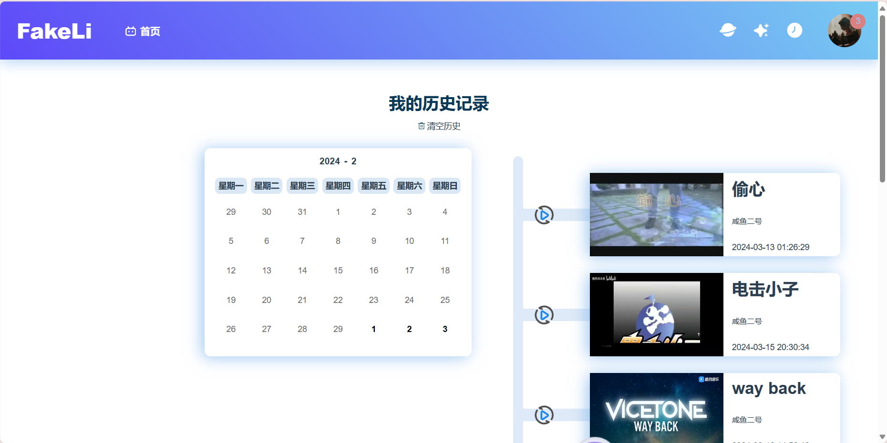
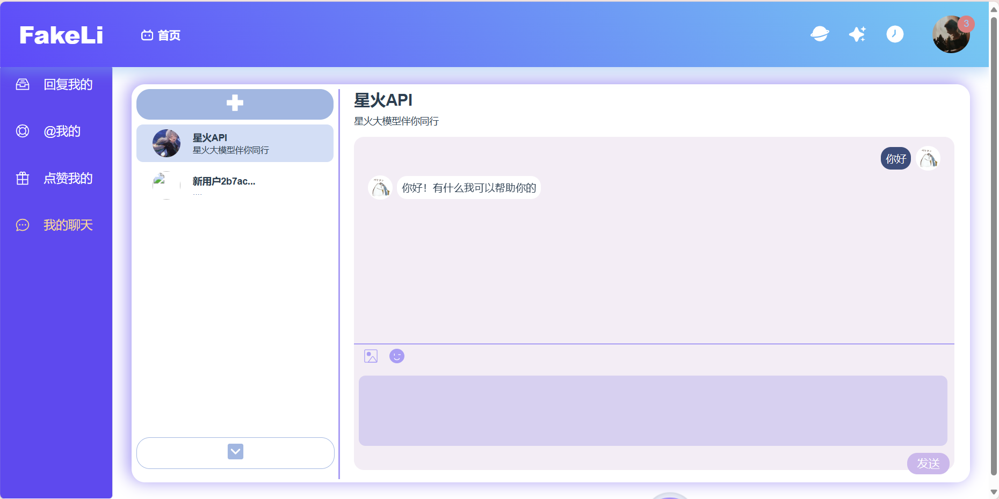

## LABiliBili视频网站

 

**Author: Alla** 
文档最新修改时间：2024.3.20
 

### 1. 项目概述
1. 技术栈：`Vue3` `ElementPlus` `Pinia` `Vue-Router` `SaSS` `WebSocket` `Axios` `Swagger` `XXL-JOB` ` ElasticSearch` `RocketMQ` `Spring Boot` `Srping Cloud` `Spring CloudAlibaba` `Redis` `Mybatis-Plus` `Druid` `MySQL`
2. 介绍：**labilibili** 是一个参考了bilibili和youtube的视频网站，采用流行Vue3 + SpringBoot + Minio + MySQL开发，旨在提供一个前后端分离、功能丰富的视频分享平台。
已上线地址：https://labilibili.com  
3. 涵盖功能：
   1. 响应式界面，兼容不同浏览器，支持PC端半屏和全屏的界面
   2. 三种登录方式（账号密码、手机号和邮箱）和注册的支持
   3. 鉴权与授权，登录态与游客态的隔离
   4. 视频的显示、点赞、收藏、弹幕、评论、项目内分享、上传
   5. 个人信息查看编辑
   6. 点赞、回复消息查看，私聊（含星火大模型）
   7. 动态、历史记录、热点等的展示
   8. 用户中心权限控制
4. 技术点：篇幅所限，在此不表

### 2. 页面展示
1. 登录页面：
    

 
2. 搜索页面：
    

3. 详情页：
    

    
4. 个人主页：
    

 

5. 历史记录
    

 

6. 私聊页面
     

 

### 3. 项目运行方式
1. 数据库部署
   1.  确保MySQL服务正在运行
   2.  创建所需的数据库，可以在项目的`sql`目录中找到初始化SQL脚本
2. 后端启动
   1. 进入后端项目目录
   2. 使用`mvn spring-boot:run`命令启动Spring Boot应用
3. 前端启动
   前端使用yarn进行操作
   1. 进入前端项目目录
   2. `yarn install` 安装所需依赖
   3. `yarn run serve`在本机运行
   4. 访问`http://127.0.0.12:2023`查看应用

### 4. 贡献指南
项目多有不足，如果想帮助**labilibili**变得更好，请遵循以下步骤：

1. Fork 本仓库。
2. 创建你的特性分支 (`git checkout -b feature/AmazingFeature`)。
3. 提交你的更改 (`git commit -m 'Add some AmazingFeature'`)。
4. 将你的更改推送到分支 (`git push origin feature/AmazingFeature`)。
5. 打开一个Pull Request。