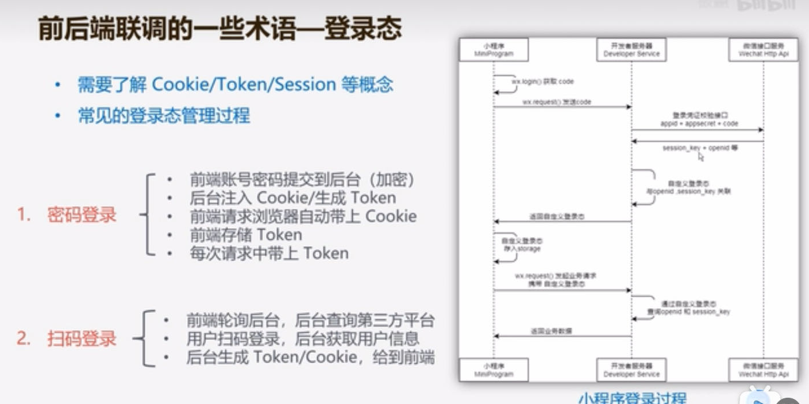

##  前后端联调错误记录

**Author: Alla**

 

|版本|撰写者|更新时间
|:----:|:----:|:----:|
|1.0|Alla|2023.12.27|
|2.0|Alla|2023.12.30|

### 1. 针对本次联调的总结
纵观联调开始到正式测试，时间起始差不多12.17-27。前期后端负责将接口与已实现功能联系起来，后期整理到swagger文档上；而前端从后端处取得数据
#### 1.1 遇到的问题
1. 前期需求不够细致
2. 缺少人手，前端技术和业务不熟
3. 时间紧张、顺序错误，没有事先定义CRUD的具体情况
4. Swagger文档和服务器的使用出现问题
5. 前端自测不够完善，联调时遇到细节问题
#### 1.2 本人的问题：仔细不足 + 沟通不到位
1. 忘记更换正式接口名
2. 没有及时询问白屏和403的报错
3. 忘记接入后端的BaseURL的跨域配置需在Vue.config.js中修改
4. 没有就get和post方式和后端及时跟进
5. 忘记前后端传参需要JSON格式，也因此需使用`window.JSON.stringify`和`window.JSON.parse`进行转换和解析（非Vue不需`window.`）
6. 当对请求参数和用例的冲突时，没有使用例子或询问后端
#### 1.3 本人应如何改进
1. 尽量记住定义的细节，若不记得则需整理下来
2. 学习mock测试，进行Java环境的自测
3. 如果不清楚，需及时询问后端
#### 1.4 其他注意事项
1. 因为axios的拦截器timeout时间设为1000ms而超时，需设为5000ms

### 2. 如何进行有效的联调
必拿下！
以下是反思或设想
#### 2.1 前期准备
前后端开发人员应了解基础的HTTP请求、状态码、数据传送流程知识(e.g.登录态)。此外，前端应掌握代理配置（HOST配置，IP代理等）和跨域技术的使用，后端应掌握swagger文档撰写、接口实现等技能

#### 2.2 明确项目规划和时间安排
前后端接口作为软件开发重要的一环，应当在前期尽早确定及设计。在迭代开发中，要为接口设计预留足够的时间，保证突发性bug对项目进程的影响降低至最小。
#### 2.2 接口设计、实现与功能完善
在接口的设计与实现过程中。
**第一步**是需求分析后，前后端开发人员就**业务**流程设计《1.0版接口》，此阶段需明确工作内容（是否需要前端进行计算）、测试接口是否能成功对接；
**第二步**应是开发过程中关注接口中的**数据字段**，在《1.0基础上》获得《2.0版接口》；
**第三步**则是前后端接口的微调，最终**交付**、使后端数据能呈现在前端页面上，本阶段需双方人员保持耐心、不断调整并改bug
#### 2.3 总结
跨域涉及到的问题或许会很麻烦，因此前后端联调需要开发者的耐心协商、积极沟通，最终提高整体效率、在规定时间内完成项目的交付