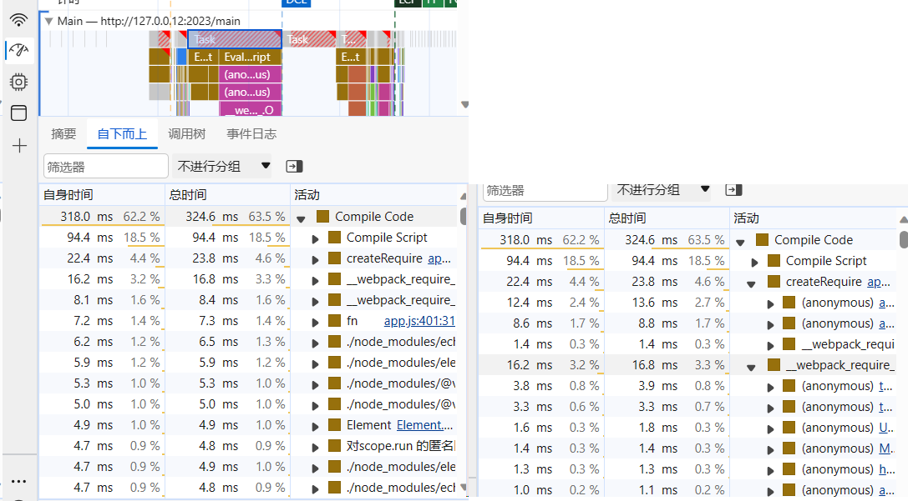

## 项目优化

**Author: Alla**
**Start-Time: 2023.12.22**
**End-Time: 2023.12.22**

<br/>

### 1. 性能损耗过大
目前使用webpack打包后，`CompileCode`环节耗费了许多时间。预计放到服务器上也会很难打开。



### 2. 没有使用缓存保存


### 3. 页面内容过多
1. 使用异步加载方法
   1. 函数：`defineAsyncComponent`
        ```js
        // 例子
        import { ElMessage } from 'element-plus'
        import { onBeforeMount, defineAsyncComponent } from 'vue'
        import { useRouter } from "vue-router"
        import { useUserInfo} from "@/store/userInfo"
        // ！！正式的例子
        const TrendAndCollect = defineAsyncComponent(()=>
          import ('./TrendAndCollect.vue')
        )
        ```
   2. 可视化演示
      在HomePage.vue中，修改如下，会发现TrendAndCollect.vue经过2s才显示
      ```js
      const time = (t, callback = () => {}) => {
        return new Promise(resolve => {
            setTimeout(() => {
            callback()
            resolve()
            }, t)
        })
      }
      const TrendAndCollect = defineAsyncComponent(()=>{
        return new Promise((resolve, reject) => {
            ;(async function () {
            try {
                await time(2000)
                const res = await import ('./TrendAndCollect.vue')
                resolve(res)
            } catch (error) {
                reject(error)
            }
            })()
        }) 
        }
      )
      ```
   4. 1