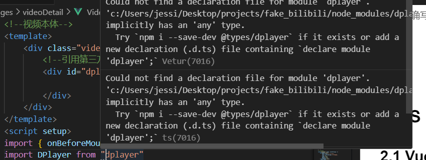

## 错误日志记录 

**Author: Alla**

[TOC]

## 1. Axios
路由、跨域之类的属实麻烦QAQ
### 1.1 axios和router.push()冲突
1. 错误代码
   @/api/index.js
   ```js
   import axios from 'axios' 
   import router from '@/router/index.js' 

   const request = axios.create({
    baseURL: 'http://localhost:3000', 
    setTimeout: 1000, // 请求超过1000ms未取得结果，提示超时
    headers: {
        'X-Requested-With': 'XMLHttpRequest',
        'jwtToken':''
    },
    withCredentials: true, // 跨域请求时是否需要使用cookies发送cookie
    })

   request.interceptors.response.use(res => {
    // 处理请求后的错误状态码
    if(res.status === 200){
        return res.data 
    }else if(res.status === 403){
        router.push('./403') // XXX[important!!]无法使用 
    }else if(res.status === 404){
        router.push('./404')
    }else{
        console.log('错误！状态码', res.status)
    }
    },err => {
        return Promise.reject(err)
    })
   ```
2. 错误结果
   1）无法跳转对应页面，如404、403
3. 错误原因
   1）(Quasar框架) 路由导出的是而非真正实例，需要让Vue自己找index
4. 正确写法
   @/api/index.js
    ```js
    import axios from 'axios' 
    import router from '../router' 
    ```
    其他不改动
### 1.2 前后端联调
1. 前端String类型传入后端变为[Object+Object]
   1. 原因：前后端用json格式的数据交互，只能传递json格式而非原生js的数据类型
   2. 
2. 1
### 1.3

## 2. JS
### 2.1 Vue项目引入纯第三方js包报错问题 
老朋友了！之前typescript项目这里也有问题QAQ
1. 具体问题
   <div align=center>
   
   </div>
2. 原因
   1. TypeScript 编译器配置：即使你的项目没有明确使用 TypeScript，但如果你的项目中存在 TypeScript 配置文件（例如 tsconfig.json），TypeScript 编译器可能会按照 TypeScript 规则来处理 JavaScript 文件。如果你的第三方包没有声明模块，TypeScript 编译器可能会发出警告或错误。
   2. 使用的第三方包的问题：某些第三方包可能没有按照规范正确声明模块，或者它们可能是非常旧的版本，不支持现代模块系统。这种情况下，你可能会遇到问题，即使你的项目是基于纯 JavaScript 的。
   3. 模块系统：Vue.js 2.x 默认使用 CommonJS 模块系统，而不是 ES6 模块系统。如果你的第三方包假设使用 ES6 模块并且没有正确声明模块，那么它们在 Vue 项目中可能会出现问题。
3. 可行的解决方案
   1. 通用：**加入声明文件（.d.ts）**
      在node_modules/xx/下新建xx.d.ts，其中写入`declare module 'xx'`，相当于将类型定义为any
   2. 通用：**下载@types/xxx包** 
      不支持ts的项目用不了
   3. 1 

### 2.2 dplayer.js的错误
1. 无法获取DOM的问题
   1. 错误：找不到DOM节点报错`.classList`，类型匹配不上报错`not find('add')`
   2. 错误信息-后者
   ```
   Cannot read properties of undefined (reading 'add')
   TypeError: Cannot read properties of undefined (reading 'add')
    at new n (webpack-internal:///./node_modules/dplayer/dist/DPlayer.min.js:4164:366)
    at eval (webpack-internal:///./node_modules/babel-loader/lib/index.js??clonedRuleSet-40.use[0]!./node_modules/vue-loader/dist/index.js??ruleSet[0].use[0]!./src/pages/videoDetail/VideoMain.vue?vue&type=script&setup=true&lang=js:137:18)
    at eval (webpack-internal:///./node_modules/@vue/runtime-core/dist/runtime-core.esm-bundler.js:2586:86)
    at callWithErrorHandling (webpack-internal:///./node_modules/@vue/runtime-core/dist/runtime-core.esm-bundler.js:285:18)
    at callWithAsyncErrorHandling (webpack-internal:///./node_modules/@vue/runtime-core/dist/runtime-core.esm-bundler.js:293:17)
    at hook.__weh.hook.__weh (webpack-internal:///./node_modules/@vue/runtime-core/dist/runtime-core.esm-bundler.js:2568:19)
    at flushPostFlushCbs (webpack-internal:///./node_modules/@vue/runtime-core/dist/runtime-core.esm-bundler.js:443:41)
    at flushJobs (webpack-internal:///./node_modules/@vue/runtime-core/dist/runtime-core.esm-bundler.js:479:5)
   ```
   报错的代码
   ```
   this.options = handleOption(_objectSpread({ preload: options.video.type === 'webtorrent' ? 'none' : 'metadata' }, options));
   ``` 
   3. 错误的解决方案：
   ```js
   // 试图通过延迟获取的方式找到DOM树 => 失败，报错Add
   export const waitForDOM = (domId) => {return new Promise((resolve) => {
   const checkInterval = setInterval(()=>{
      const dom = document.getElementById(domId)
      if(dom){
            clearInterval(checkInterval) // 停止定时检查
            resolve(dom) // 传给resolve
      }}, 1000) // 1秒检查一次
      })
   }
   // 使用func的格式返回变量 => 失败，报错Add
   const opt = {
      container: async()=>{
         return await waitForDOM
      },
      video:{
         url: 'http://clips.vorwaerts-gmbh.de/big_buck_bunny.mp4',
         type: 'auto' // 虽然例子中没写type，但不写用不了
      }
   }
   // 想用载入Object的方式在onMounted周期后调用 => 报错“没有dplayer.volume”这个函数
   const setVolume = (dplayer, per) =>{
      dplayer.volume(per, true, false)    
   }
   onMounted(()=>{
      dp.value = new DPlayer(opt) // 显然这句用不了
   })
   ```
   4. 正确的解决方案：将dp和它的配置、函数都扔到onMounted后，取消函数中传dp这个对象
   ```js
   <scirpt stup>
      onMounted(()=>{
         const opt = {
         container: document.getElementById('player'),
         autoplay: true,
         theme: '#FADFA3',
         loop: true,
         lang: 'zh-cn',
         screenshot: true,
         hotkey: true,
         preload: 'auto',
         logo: 'logo.png',
         volume: 0.7,
         mutex: true,
         video: {
            url: 'http://clips.vorwaerts-gmbh.de/big_buck_bunny.mp4',
            type: 'auto'
         }
      }
      console.log('验证1')
      dp.value = new DPlayer(opt)
      })
   </scirpt>
   ```
   5. 备注：真奇怪？为什么呢？明明生成DOM树的步骤在js前才对啊，理论上应该能获取到QWQ
   6. 解决思路：整个JS初始化和操作等在找到`dp`这个dom节点的基础上
2. Vue中第三方包跨域问题
印象中用过百度地图的插件，但记得没引起跨域的错误。想起来了！之前天气插件似乎也因为跨域而用不了（当时没空找解决方案Orz
   1. 错误信息
      <div align=center>
      
      </div>
   2. 错误原因：跨域URL问题。之前百度地图的插件使用的是本地（静态）数据，没有申请到其他域
   3. 解决实行
      1. 方案1 - 使用
         1. `build.js`
      2. 方案2 - 使用jsonp（仅使用支持JSONP的服务）【未测试】
         1. 
         2. 这只适用于你能够控制资源服务器的情况。
      3. 方案3 - 使用代理服务器【未测试】
         **step 1** **：
         **step 2** **：
         **step 3** **：
         **step 4** **： 
      4. 方案4 - 使用CORS进行跨域资源共享【未测试】
         [Attention]：CORS 只在支持它的浏览器中生效，而不是在所有情况下都能解决跨域问题。另外，服务器端必须正确配置 CORS 规则，以允许来自特定来源的请求。
         **step 1** *服务器*：在提供视频的服务器上配置，允许特定来源的请求。通常涉及到在 HTTP 响应头中包含 CORS 相关的头信息
         ```
         // 关于访问资源的来源
         Access-Control-Allow-Origin: * // *是指所有，https://expamle.com指特定
         // 指定允许的HTTP方法
         Access-Control-Allow-Methods: GET, POST
         // 指定允许的 HTTP 头字段，例如 Content-Type、Authorization 等
         Access-Control-Allow-Headers: Content-Type
         // 指定浏览器可以访问的响应头字段
         Access-Control-Expose-Headers: X-Custom-Header
         // 是否允许发送身份凭证（例如 cookies、HTTP 认证等）
         Access-Control-Allow-Credentials: true
         ```
         **step 2** *客户端*：在客户端代码中，你可以使用 JavaScript 来发起跨域请求，**关注URL和方法即可**。在 DPlayer.js 中，将视频 URL 设置为视频资源服务器的 URL，然后在浏览器中发起请求。
         ```js
         const dp = new DPlayer({
            container: document.getElementById('player'),
            video: {
               url: 'https://video-resource-server.com/video.mp4', // 视频资源服务器的 URL
               },
         });
         ```
         **step 3** *浏览器*： 当浏览器发起跨域请求时，它会首先发送一个预检请求（OPTIONS 请求）到服务器，以确定是否允许跨域请求。服务器会根据 CORS 配置进行响应
         **step 4** 处理响应：若服务器允许跨域请求，浏览器将收到正常的响应。你可以在 DPlayer.js 中处理视频资源的响应，播放视频等操作
      5. 方案5 - 如何
      6. 
   4. 方案总结
      1. 
      2. 2
   5. 参考
      1. 《Vue项目调用第三方API如百度地图》：https://blog.csdn.net/AAAXiaoApple/article/details/122349021
      2. 1
   6. 
   
## 3. CSS 
### 3.1 video标签
1. img标签和video使用`v-if`切换时布局会乱。因为`img`标签是内联元素，`video`是块级元素。所以，
   ```html
   <div class="container"><!--需要加个container-->
      
      <div v-else><video src="yyy"></video></div> 
   </div>
   ```
2. 1

## 4. Uniapp
### 2.1 如果
### 2.2 如果