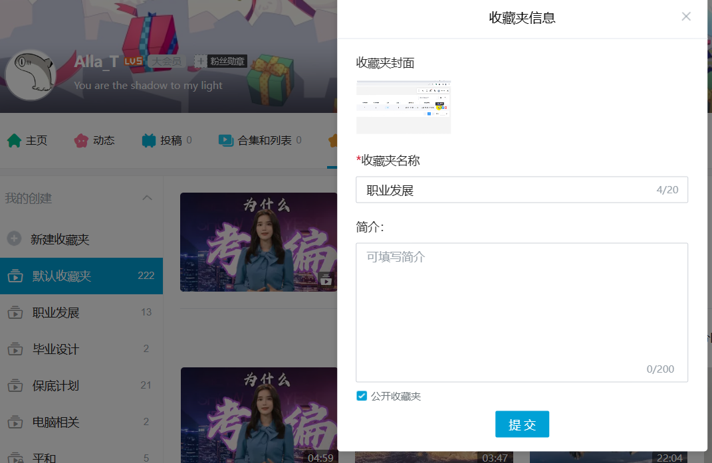
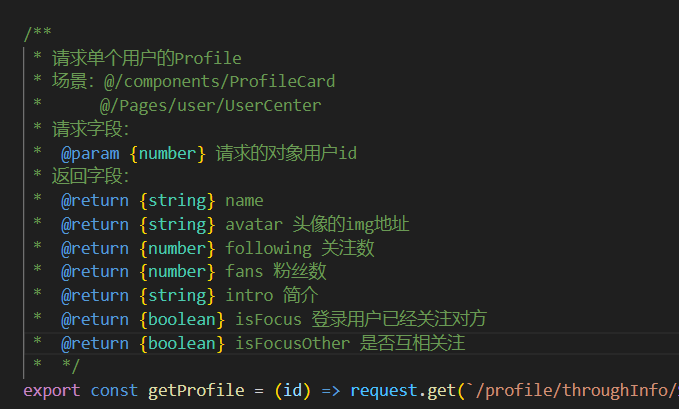

## 接口文档

[TOC]

### 1. 登录页
1. 未完成接口
   1. [get] 验证码：入参none，传参待改
   2. [get] 登录验证： 入参none，传参待改

### 2. 首页，视频详情和个人主页
### 2.1 视频接口
1. 已完成接口
   1. [get] 视频详情页 - 视频接口
   2. [post] 个人主页 - 发布视频
   3. [get] 视频详情页 - 推荐视频 
2. 待修改接口
   1. [get] 首页-查询中返回参数增加cover字段
3. 未完成接口
   1. [get] 个人主页 - **查看我投稿的视频**
   2. [get] 个人主页 - **查看我收藏的视频：需要有收藏夹id和用户id字段**
   3. [post] 个人主页 - **修改视频**
### 2.2 评论接口
本部分由Alla负责定义
### 2.3 收藏和收藏夹接口
1. 未完成接口
   1. [get] 视频详情页 - **查看收藏夹**
   2. [post] 视频详情页 - **将视频加入收藏夹**
      
   3. [post] 视频详情页 - **新建收藏夹**
      
   4. [post] 个人主页 - **修改收藏夹**
      
   5. [post] 个人主页 - **删除收藏夹**
   6. [post] 视频详情&个人主页 - **将视频移出收藏夹**
### 2.5 关注和信息
1. 未完成接口
   1. [get] 个人主页&简介弹窗 - **查询用户信息和关注数**（增加了是否互相关注字段）
      
   2. [post] 个人主页 - **修改用户信息**
   3. [post] 个人主页&简介弹窗 - **确认关注**
   4. [post] 个人主页&简介弹窗 - **取消关注**
   5. [get] 个人主页&简介弹窗 - **查询关注列表**：返回项参考*查询用户信息和关注数*
   6. [get] 个人主页&简介弹窗 - **查询粉丝列表**
### 2.6 点赞和@
1. 未完成接口
   1. [post] 视频详情页&个人主页 - **成功点赞或@**
   2. [post] 视频详情页&个人主页 - **取消点赞或@（和评论一起被删）**
### 2.6 弹幕：参考dplayer.js的弹幕
1. 未完成接口
   1. [get] 视频详情页 - **查看所有弹幕**
   2. [post] 视频详情页 - 伪实时**发送弹幕弹幕**
    
### 3. 通知和私聊【改】
消息通知主要通过后端传递生成。
### 3.1 通知
1. 未完成接口
   1. （get 查看未读消息数 -> 建议放在首页获取个人信息的接口中）
   2. [get] 通知栏 - **查看所有通知**
   3. （可选）[get] 通知栏 - **查看已读通知**
   4. （可选）[get] 通知栏 - **查看未读通知**
   5. [post] 通知栏 - **标记通知为已读**
   6. [post] 通知栏 - **删除通知**
   7. [post] 通知栏 - **删除通知**
### 3.2 私聊
1. 未完成接口
   1. [get] 聊天室 - 左栏 - **获取聊天用户的信息和最近一条消息**：信息包括userid, avatar, name
   2. [post] 聊天室 -中间 - **发布聊天消息**
   3. [get] 聊天室 -中间 - **历史消息消息**

### 4. 动态【改】
假设动态的点赞，评论和@这三种消息能使用公共组件，依据评论区/视频/来源的不同而不同
1. 未完成接口
   1. [get] 动态栏 - **查看动态**
   2. [get] 动态栏 - **发布动态**：未用到前端接口？（但是其他user发布的时候也会用接口吧
   
 

-END-
如有错误，请指出！！